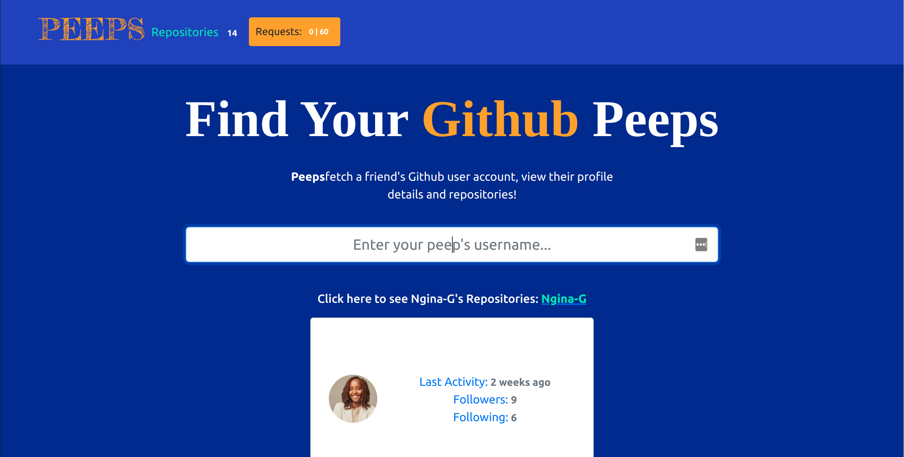

# PEEPS

## PEEPS (Github Search App)

 

## Description
A web application where users may enter a GitHub username into a form, submit it, and see names and descriptions of that person's public repositories.
 
This project was generated with [Angular CLI](https://github.com/angular/angular-cli) version 13.3.0.

### Check live demonstration <a href="https://ngina-g.github.io/Github-Search/"><strong>here</strong></a>
 
 

#### Requirements
JSFiddle or JavaScript Console, Angular, Typescript.

### Setup Instructions and Installation
Fork or clone this repository to a location in your file system. git clone https://github.com/Ngina-G/Github-Search.git
Open terminal command line then navigate to the root folder of the application. cd Ngina-G.github.io
Run $ ng serve -o.

### Behavior Driven Development 
<dl>
<dt>Displays landing page with CTAs to enter Github username</dt>
    <dd>INPUT: "Clicks enter"</dd>
    <dd>OUTPUT: "Opens Repositories Page"</dd>
</dl>

### Known bugs
If you find a bug (the website couldn't handle the query and or gave undesired results), kindly open an issue here by including your search query and the expected result.

If you'd like to request a new function, feel free to do so by opening an issue here. Please include sample queries and their corresponding results.

## Technologies Used
TYPESCRIPT and Angular.

### License
 MIT License

Copyright (c) 2022 Ngina

### Contact Me
Visit my website [here](https://www.nginagitau.com/).
If you have any questions or comments, 
conatct me at Nginagitau11@outlook.com

### TO DO
Include interactivity that allows the user to move more than one chess piece.

#### Development server

Run `ng serve` for a dev server. Navigate to `http://localhost:4200/`. The application will automatically reload if you change any of the source files.

#### Code scaffolding

Run `ng generate component component-name` to generate a new component. You can also use `ng generate directive|pipe|service|class|guard|interface|enum|module`.

#### Build

Run `ng build` to build the project. The build artifacts will be stored in the `dist/` directory.

#### Running unit tests

Run `ng test` to execute the unit tests via [Karma](https://karma-runner.github.io).

#### Running end-to-end tests

Run `ng e2e` to execute the end-to-end tests via a platform of your choice. To use this command, you need to first add a package that implements end-to-end testing capabilities.

#### Further help

To get more help on the Angular CLI use `ng help` or go check out the [Angular CLI Overview and Command Reference](https://angular.io/cli) page.
